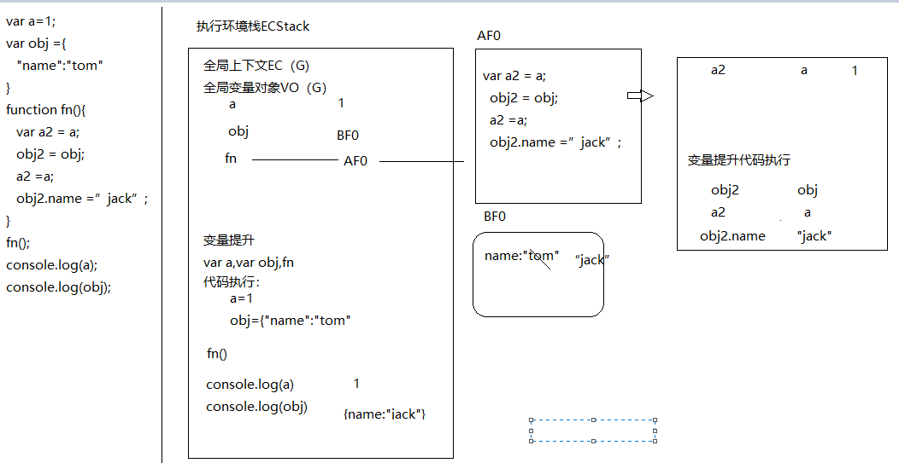
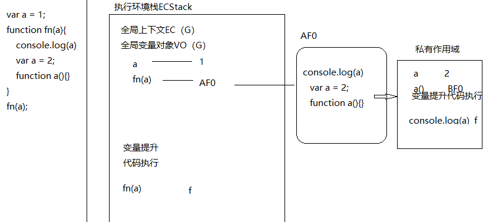
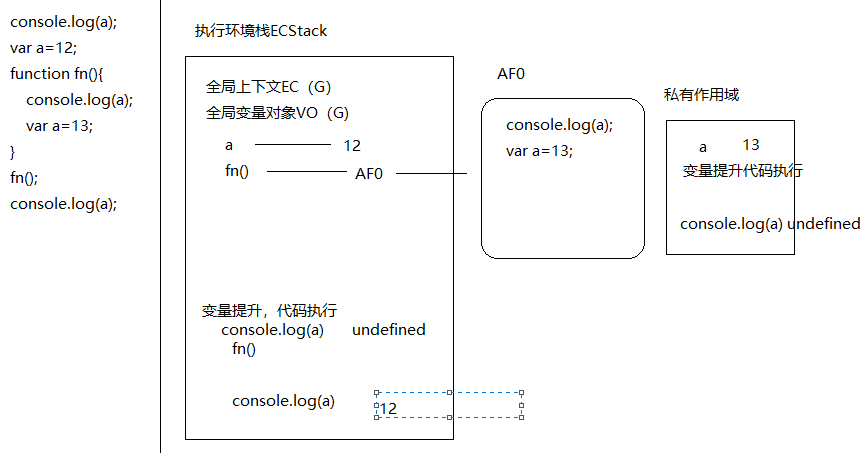
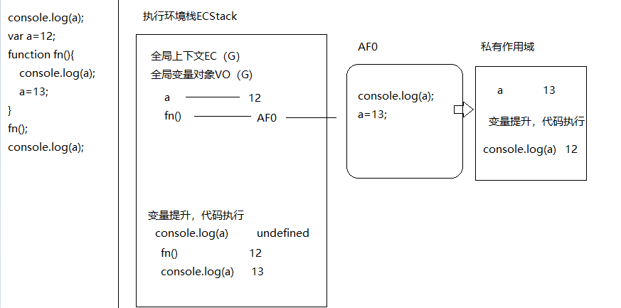
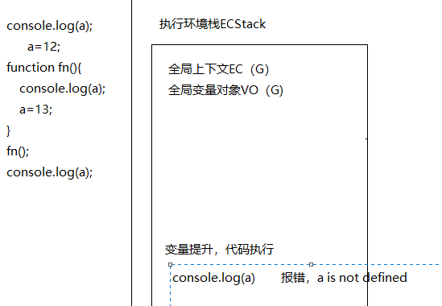
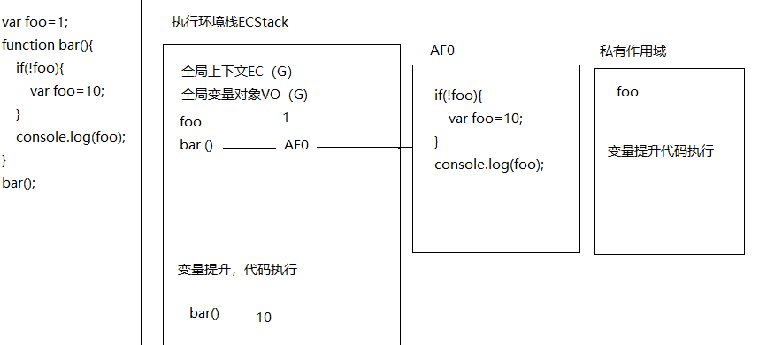
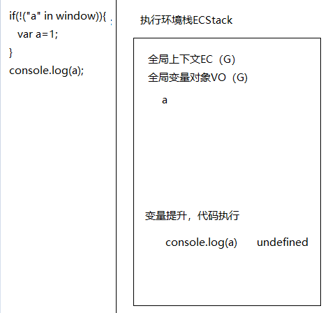
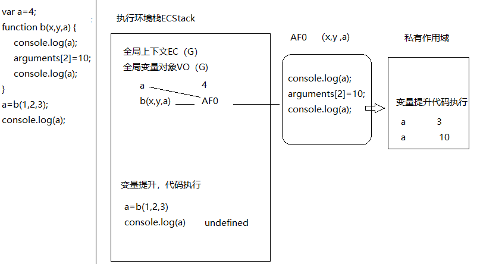

####1、
+ undefined   13
+  报错
+  报错
####2、
+ undefined,undefined,undefined
+ 10,13,14
+ 100,13,200
+ 100,undefined,200
https://github.com/mazizhao/LearningJs/blob/master/20200319/1584588504297.png
####3、
+ [12,13]
+ [0]
+ [100,23]
https://github.com/mazizhao/LearningJs/blob/master/20200319/1584591095866.png
####4、
+ 10 
+ 10
https://github.com/mazizhao/LearningJs/blob/master/20200319/1584594236710.png
####5、
+ 1
+ {name:"jack"}

####6、
+ f  a(){}

####7、
+ undefined   undefined   12

+ undefined   12  13

+  报错

####8、
+ 10

####9、
+ 10
+ 11
+ 3
####10、
+ undefined

####11、
+ 3  10
+ undefined

####12、
+ hello
+ hello
+ hello