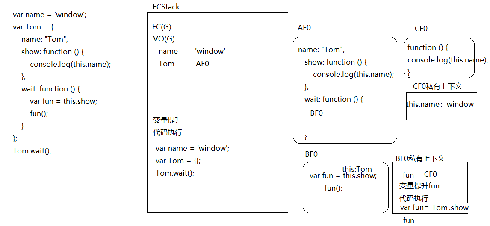
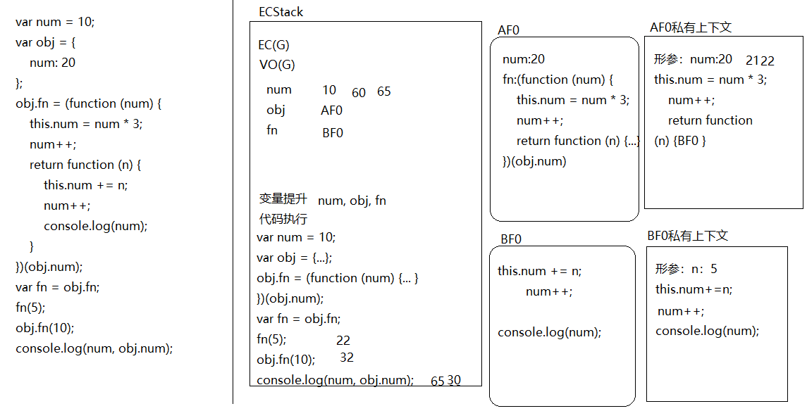

####1、
+ fn:f
+ window，严格模式下undefined
(./1584846380646.png)
####2、
+ undefined
+ 'language'
(./1584847089285.png)
####3、
+ window

####4、
+ "24"
(./1584853107315.png)
####5、
+ 12
####6、
+ 22
+ 32
+ 65
+ 30

####7、
+ 不能实现
+ 无论点击哪个按钮弹出的都是4
```
for(var i=0;i<l;i++){
	l.index=i;
	inputs[i].onclick=function(){
		alert(this.index+1);
	}
}
```
+ 因为代码是从上而下执行的，在循环绑定事件中，绑定的时间不触发是不会执行的，而此时的for循环早已循环结束，并把var声明的全局i的值改为4，所以无论点击哪个按钮都会弹出4；我们需要它弹出我们想要的值，就需要设定一个自定义属性，提前把该按钮的索引存储起来，后面直接调用就可以了
+ 基于ES6let解决：var改为let
+ 基于闭包解决：
```
inputs[i].onclick=(function(i){
   return function(){
       alert(i+1);
   }
}(i));
```
####8、
+ 闭包：在函数执行中，会形成一个私有上下文，里面声明的变量不会影响外界或者造成全局变量污染
+ 优点：不会造成全局变量污染，便于封装插件或者类库
+ 缺点：太耗费性能，需要手动释放
####9、
+ let 没有变量提升，可以解决暂时性死区问题，不允许重复声明
+ var有变量提升，可以重复声明
####10、
```
for (let i = 0; i < 10; i++) {
    setTimeout(() => {
        console.log(i);
    }, 1000);
}
```
####11、
+  function   20   
```
let b = 20;
```