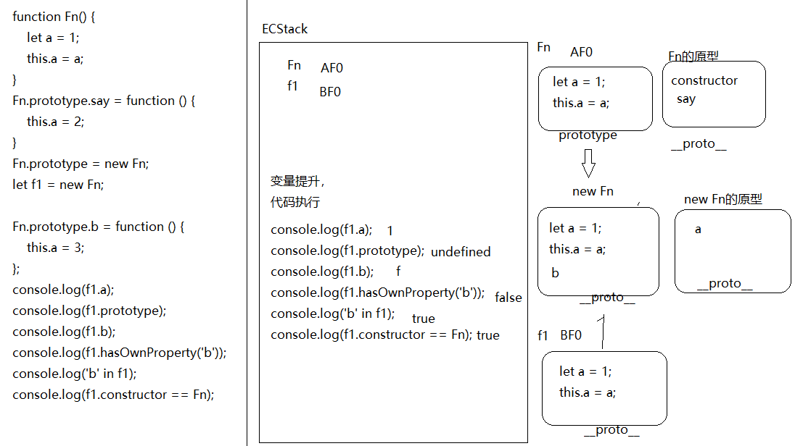

####1、
```
function fn(a,b){
  let item=a+b;
  return function(c){
    return item+c;
  }
}
```
####2、
+ 7
+ 10
+ 16， 15

####3、
+ false
+ true
+ true
+ false
+ f
+ 10
+ NaN
+ -1
+ NaN
+ 报错

####4、
+ 0
+ 30

####5、
+ "Tomundefinedjoin"

####6、
+ 1
+ undefined
+ f
+ false
+ true
+ true

####7、
+ zhufeng  5000
+ zhufeng   9
+ 9
+ 5000

####8、
```
 Object.prototype.plus = function plus(num) {
      if (isNaN(num)) {
        num=0;
      }
      return this + num;
    };
    Object.prototype.minus = function minus(num) {
      if (isNaN(num)) {
        num=0;
      }
      return this - num;
    };
    let n = 10;
    let m = n.plus(10).minus(5);
    console.log(m);
```
####9、
```
  Array.prototype.unique = function unique() {
      let obj = {};
      for (let i = 0; i < this.length; i++) {
        let item = this[i];
        if (typeof obj[item] === "undefined") {
          obj[item] = item;
        }else{
          this[i] = this[this.length-1];
          this.length--;
          i--;
        }
      }
      obj=null;
      return this;
    };
    let ary = [12, 23, 12, 13, 13, 12, 23, 14, 8];
    ary.unique().sort((a, b) => a - b);
    console.log(ary)
```
10、
```
// 有问题
String.prototype.getParam = function getParam(key) {
      let askindex = this.indexOf("?"),
        text = this.substring(askindex + 1),
        obj = {};
      askindex !== -1 ? text : null;
      let arr = text.split("&");
      arr.forEach(item => {
        let every = item.split('=');
        obj[every[0]] = every[1];
        if (key === obj[every[0]]) {
          console.log(every[1]);
        }
      });
    }
```
####附加题1、
```
//已查
 function _new(Func,...args) {
      let obj = Object.create(Func.prototype);
      let result = Func.call(obj, ...args);
      return result !== null && (typeof result === "object" || typeof result === "function") ? result : obj
    }
```
####2、
```
//已查
 let a = {
      b: 1,
      valueOf() { return this.b++ }
};
```
####3、
+obj{
	2:1，
	3:2，
	length:4,
	push:Array.prototype.push
}

####4、
+2 4 1 1 2 

